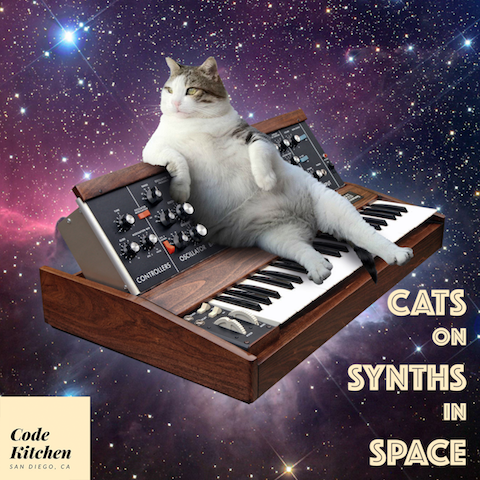

# Cats on Synths in SPACE!!!
Creating old school analog synths in MaxMSP!

Join us Wednesday for another Code Kitchen workshop! This week we will be recreating old school analog synthesizers on our computers. Learn the basics of how to create the classic sound of synthesizers. This workshop will cover some basics of patch programming with MaxMSP. Even if you're not into synthesizers, MaxMSP is a great tool to have in your creative coding toolbox. At the end of the workshop you will have a fully playable synthesizer on your computer and resources for where to go next in your patching journey.

*** Please bring a laptop for this workshop ***  
Also, install the MaxMSP demo before coming to the workshop so we aren't all trying to download it at the same time.  
https://cycling74.com/downloads/#.WL2s7RIrKEI  
No need to start the trial, just installing the demo will cover our needs for the workshop.
